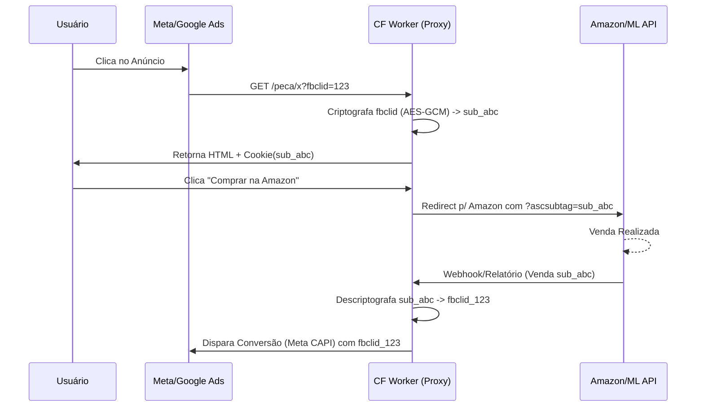
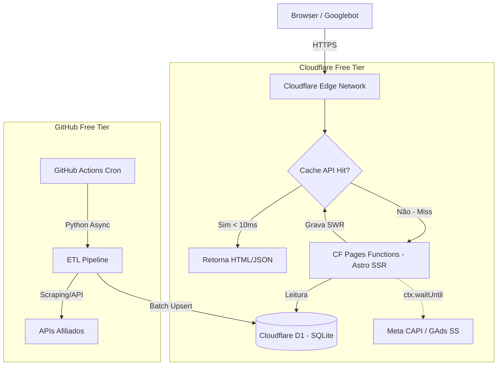

# Fase 1: Fundamentos de Negócio e Infraestrutura Edge**

---

## SEÇÃO 1: Modelo de Negócio, Unit Economics & Mecânica de Arbitragem

### 1.1. Modelagem Monetária Dupla
A plataforma opera sob um modelo híbrido de monetização para maximizar o **RPM (Revenue Per Mille)** da página, garantindo que o tráfego pago que não converte em vendas ainda gere receita residual.

*   **Monetização Primária (Afiliados - CPA/RevShare):**
    *   **Amazon Associates:** Integração via links parametrizados utilizando a tag `ascsubtag` para injeção de Click IDs dinâmicos.
    *   **Mercado Livre / Shopee:** Utilização de parâmetros de rastreamento customizados (`sub_id` ou `aff_sub`) nas URLs de redirecionamento.
    *   *UX/UI:* Botões de CTA ("Comparar Preços", "Ver Oferta") renderizados no Edge com preços atualizados para maximizar o CTR (Click-Through Rate).
*   **Monetização Secundária (Mídia Display - CPM):**
    *   **AdTech Stack:** Google AdSense / Google AdX via parceiros de monetização (ex: Ezoic, Setupad) focados em blocos nativos.
    *   *Performance:* Inserção estrita via *Lazy Loading* (Intersection Observer) e carregamento assíncrono após o evento `window.onload`. Nenhum script de anúncio pode bloquear a thread principal ou impactar o LCP (Largest Contentful Paint).

### 1.2. Matriz de Arbitragem de Tráfego & Sub-ID Mapping (CRÍTICO)
Para que a arbitragem (comprar tráfego no Meta/Google e rentabilizar no Afiliado) seja escalável, o rastreamento determinístico *Click-to-Sale* é obrigatório. Redes de afiliados não repassam parâmetros de mídia (`fbclid`, `gclid`) no checkout. A solução é um **Proxy de Click ID no Edge**.

**O Gargalo do Banco de Dados:** O tier gratuito do Cloudflare D1 permite apenas 100.000 escritas/dia. Salvar um ID no banco a cada clique de anúncio esgotaria a cota rapidamente e derrubaria o sistema sob ataque de bots ou escala de tráfego.

**A Solução (Stateless Sub-ID via Criptografia):** O sistema opera com **Custo Zero de Banco de Dados na entrada**. O Worker intercepta o `fbclid`/`gclid`, concatena com um timestamp e criptografa o payload usando **AES-GCM (Web Crypto API)** com uma chave secreta (`env.SECRET_KEY`). O resultado em Base64URL torna-se o `sub_id`. O banco de dados nunca é tocado durante o clique.

**Equação de Viabilidade:**
`Margem = [(EPC_Afiliado * CTR_Outbound) + RPM_Display] - (CPC_Mídia + Impostos)`

**Fluxo de Sub-ID Mapping Stateless (Edge Worker):**

### 1.3. Modelagem de Risco e Tributação de Mídia
Na arbitragem, o volume de capital investido em anúncios (Ad Spend) é alto. Se a receita bruta for tributada integralmente, a margem colapsa.
*   **Engenharia Contábil:** A empresa deve operar sob o CNAE de **Intermediação de Negócios / Promoção de Vendas**.
*   **Mitigação:** O faturamento (emissão de Nota Fiscal) ocorre **apenas sobre a comissão recebida** das redes de afiliados e do AdSense, não sobre o GMV (Gross Merchandise Volume) dos produtos. O capital de giro para tráfego deve ser isolado em contas de contingência para evitar bitributação.

---

## SEÇÃO 2: Arquitetura da Stack Zero Custo & Edge Computing

A infraestrutura foi desenhada sob o paradigma **Jamstack Edge-First**, utilizando exclusivamente os *Free Tiers* do ecossistema Cloudflare e GitHub.

### 2.1. Desenho da Arquitetura Física

### 2.2. Camadas da Infraestrutura
1.  **Renderização & Hosting (Cloudflare Pages + Astro v4):**
    *   **Modo Híbrido (`output: 'hybrid'`):**
        *   *SSG (Static Site Generation):* Páginas de categorias, home e institucionais. Custo computacional zero no request.
        *   *SSR (Server-Side Rendering):* Páginas de produtos/peças específicas. Executadas via Cloudflare Pages Functions (Workers sob o capô) para injetar preços em tempo real e gerenciar o Sub-ID Mapping.
2.  **Banco de Dados Edge & Cache (CRÍTICO):**
    *   **Cloudflare D1:** Banco relacional SQLite distribuído no Edge. Armazena o catálogo de peças, eletrônicos e compatibilidades.
    *   **Cloudflare Cache API (Stale-While-Revalidate):** Implementação obrigatória. O Worker intercepta a requisição SSR, verifica a Cache API. Se houver cache (mesmo expirado - *stale*), devolve ao usuário instantaneamente e revalida o D1 em background. Isso reduz as leituras no D1 em 99%.
3.  **Automação & ETL (GitHub Actions):**
    *   Orquestração de scripts Python (`asyncio`, `aiohttp`) para ingestão de dados, sanitização e atualização de preços.

### 2.3. Análise de Limits & Throttling (Bypass do Free Tier)

A tabela abaixo define as restrições físicas da stack gratuita e as decisões arquiteturais (ADRs) para contorná-las.

| Serviço | Limite Gratuito | Risco na Arquitetura | Estratégia de Mitigação (Bypass) |
| :--- | :--- | :--- | :--- |
| **Cloudflare D1** | 5 Milhões de leituras / dia | Tráfego pSEO + Bots esgotariam a cota em horas. | **Cache API SWR:** O D1 só é consultado 1x por URL a cada 4 horas. O resto é servido via Cache API (limite ilimitado). |
| **Cloudflare D1** | 100 Mil escritas / dia | Atualizar 100k SKUs individualmente estouraria o limite. | **Batch Upserts:** O ETL no GitHub Actions agrupa atualizações e faz inserções em lotes (`INSERT ... ON CONFLICT`) de 1.000 linhas por query. |
| **CF Pages Functions** | 100 Mil requests / dia | Tráfego de arbitragem alto derrubaria o site. | **Page Rules & SSG:** Arquivos estáticos (JS/CSS/Imagens) e rotas SSG bypassam as Functions. Apenas rotas SSR dinâmicas consomem a cota. |
| **GitHub Actions** | 2.000 Minutos / mês | Scraping diário de todo o banco causaria Timeout. | **ETL Curva ABC:** Atualização assimétrica. Apenas produtos com tráfego recente (Curva A) atualizam frequentemente. (Detalhado na Seção 3). |
| **Cloudflare KV / D1** | 100 Mil escritas / dia | Esgotamento ao salvar Sub-IDs em cada clique de anúncio. | **Stateless Sub-ID (Web Crypto API):** O ID de clique não é salvo no banco. Ele é criptografado (AES-GCM) e passado via URL/Cookie, sendo descriptografado apenas na conversão. |

---

### CHECKPOINT DA FASE 1

A base de negócios e a infraestrutura física estão documentadas com as travas de segurança exigidas.